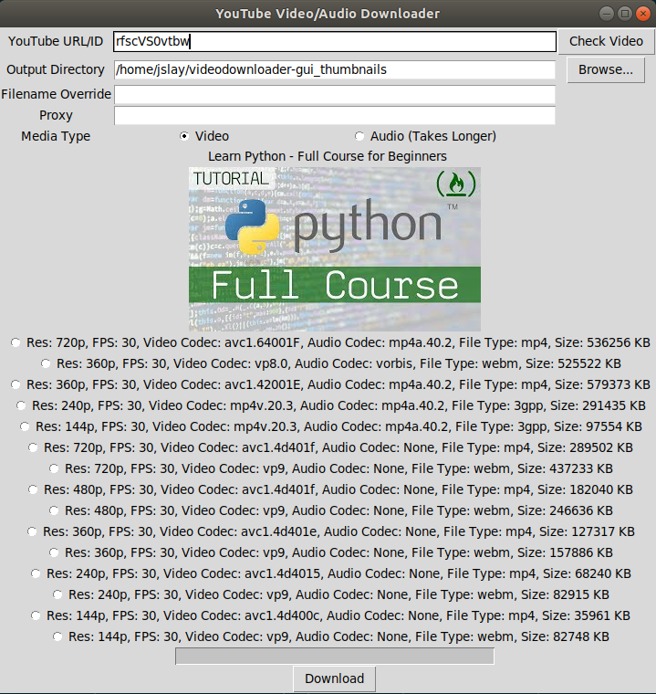

# videodownloader
A Simple Script written in Python to Download YouTube Videos
These videos can also be downloaded as audio

### Installation
1. Clone the Repo
```Bash
cd videodownloader
# run pipenv shell
pipenv shell
# Then install the dependencies
pipenv install
# To Run the script 
python3 script.py
```

### Usage

You can either run the GUI (`gui.py`), the script (`script.py`) directly for interactive mode,
or use the command line arguments on the script (`script.py`).

    python3 gui.py
    python3 script.py
    python3 script.py -u rfscVS0vtbw -o videos/ -f my_downloaded_video
    python3 script.py -u rfscVS0vtbw -o audio/ -f my_downloaded_audio --audio-only
    python3 script.py --help
    
    -u --url            YouTube URL or YouTube Video ID to download
    -o --output-path    Output Directory Path
    -f --filename       Override the output filename. Does not override file extension
    -a --audio-only     Download Audio Only
    -p --proxy          Proxy to use. Ex http://xxx.xxx.xxx:8080
    


If you would like to suggest changes feel free to fork this repo and create PR or submit an issue

Feel Free to DM on twitter if you have any questions
[twitter](http://www.twitter.com/muhammad_o7)



Here's the demo on how to use it

<div align="center">
  <a href="https://vimeo.com/281200561"></a><br>
</div>

